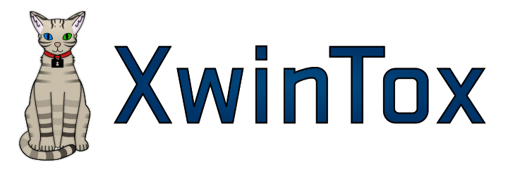

XwinTox
==============

Overview
--------------

*XwinTox* is a radical Tox client.

At its heart is the XwinTox Framework, which is a C-based framework that
utilises advanced object-oriented design principles, allowing for easy
manipulation from C++ or any other language a wrapper may be written for, as
well as decoupling the GUI from the libTox-Core -utilising MCommTox subsystem.
As well as this, it makes the development of plugins simple, and provides a
comprehensive set of security provisions that allow the user to configure the
exact set of data that a plugin may have access to.

Note that XwinTox Frameworks 2, the new branch of XwinTox which is discussed in
this README, has not yet implemented all functionality described.

Screenshot
--------------

Building
--------------

XwinTox currently uses mk-configure.
You should be able to find it in your distribution's repository. 

Design and Development
--------------

In the near future, a comprehensive developer's guide shall be written and will
appear in a subfolder of this repository, `docs/`.

The XwinTox Framework consists of two main components: the module manager and
the XwinTox program itself. These implement no GUI or instant-messaging
communications logic. 

A set of interface structures are provided by XwinTox to module developers in
`xwintox/hdr/AOM`. A module is developed for C by implementing one of these
interfaces (or more than one, if desired; modules may export multiple objects
that they may handle). This is done by creating an instance of the interface
structure and setting appropriately its member variables and methods in line
with desires.

No direct access is provided to objects other than the object you have written.
Many functions are offered by other modules, however, that allow manipulation
theseof. There also exist implicit techniques for appropriately utilising loaded
objects; for example, the GUI is informed when a new object has become available
for instantiation that lays outwith the standard XwinTox application object
model. This is used to implement a list of available plugins in the GUI; the
user may enable and disable these at their will. A toolkit-agnostic interface
is provided for the implementation of GUI elements for plugins. This avoids the
need to write custom functionality to draw such per each supported widget.
In those rare cases where it is necessary, a module may request from the XwinTox
Framework a handle to the root GUI object. This is not available without user
permission.
